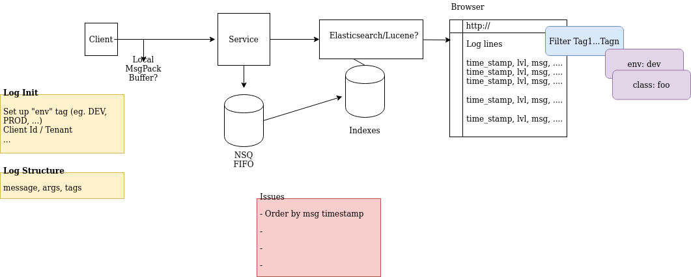

Luna - A Simple Distributed Logger
============

Initial components being considered:

  * Client (obviously)
  * Logger API
  * NSQ
  * ElasticSearch
  * Log Viewer (Browser / Electron App)

### Simple Architecture

